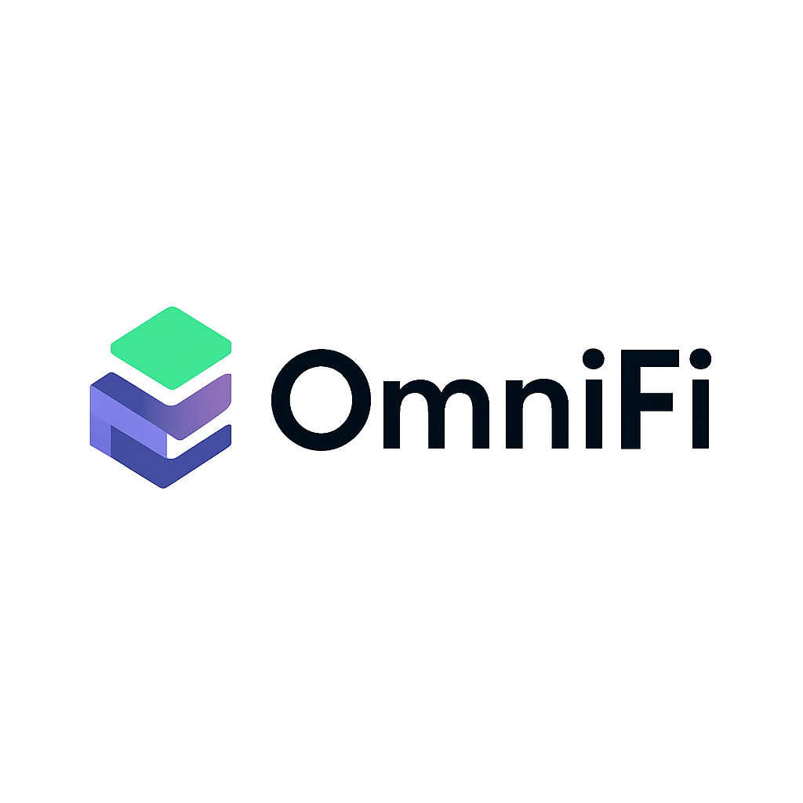

<div align="left">
  
  <h1>OmniFi</h1>
  <h4>Next-Gen Cross-Chain DeFi Protocol for Real-World Assets</h4>
  <p><em>Built for the Chainlink Hackathon</em></p>
</div>

---

## 🧠 Problem Statement

Despite the explosive growth of decentralized finance, **real-world assets (RWAs)** like carbon credits, real estate, and commodities remain **isolated from the on-chain world**. These assets are stuck in traditional infrastructure — lacking accessibility, liquidity, and automation.

> Even platforms that attempt to tokenize RWAs fail to provide true value due to poor **price discovery**, **volatility management**, and **cross-chain operability**.

---

## 💡 Our Solution: OmniFi

**OmniFi** is a **cross-chain RWA vault** that bridges real-world assets into DeFi using a secure, automated, and intelligent system. The protocol offers a comprehensive asset management flow — from tokenization to risk-based rebalancing.

### ✨ Highlights

- **Tokenizes Real-World Assets** (e.g. carbon credits)
- **Calculates Live Valuations** using Chainlink Data Feeds
- **Manages Risk** through an on-chain Volatility Index
- **Rebalances Tokens** across chains using Chainlink Automation
- **Supports Manual Transfers** via Chainlink CCIP and a Mint/Burn system

---

## 🔄 Workflow

Here’s how OmniFi works end-to-end:

1. **Connect Wallet**: Users authenticate via MetaMask.
2. **Tokenize RWAs**: Select asset type (e.g., carbon credit), complete mock verification.
3. **Mint Tokens**: Custom ERC-20 tokens are minted on **Avalanche Fuji**.
4. **Vault Deposit**: Tokens are stored in a personal vault.
5. **Valuation**: Chainlink **ETH/USD Data Feeds** determine accurate token values.
6. **Volatility Monitoring**: A custom volatility index tracks price shifts.
7. **Auto-Rebalance**: If volatility exceeds **5%**, Chainlink **Automation** rebalances tokens across supported chains.
8. **Manual Transfer**: Users can initiate secure cross-chain transfers via Chainlink **CCIP**, using a **Mint & Burn** mechanism (Avalanche → Base Sepolia).

All events are verifiable on **Snowtrace**.

---

## 📺 Live Demo

🎥 [Watch the YouTube Demo](#) *(replace this with your actual demo link)*

---

## 🌐 Project Links

- 🌍 **Website**: [omni-fi-ruxn.vercel.app](https://omni-fi-ruxn.vercel.app)
- 🧠 **GitHub**: [github.com/chrsnikhil/OmniFi](https://github.com/chrsnikhil/OmniFi)

---

## ⚙️ Tech Stack

| Category             | Technology              |
|----------------------|--------------------------|
| **Frontend**         | React, Tailwind CSS      |
| **Smart Contracts**  | Solidity (ERC-20)        |
| **Chain 1**          | Avalanche Fuji (Testnet) |
| **Chain 2**          | Base Sepolia (Testnet)   |
| **Wallet**           | MetaMask                 |
| **Price Feeds**      | Chainlink Data Feeds     |
| **Automation**       | Chainlink Automation     |
| **Interop**          | Chainlink CCIP           |
| **Block Explorer**   | Snowtrace                |

---

## 🧪 Features Breakdown

### 🔹 Real-World Asset Tokenization
Mint ERC-20 tokens that represent real-world assets using a streamlined verification process.

### 🔹 Vault-Based Storage
Each user has their own on-chain vault to deposit, track, and withdraw tokens.

### 🔹 Dynamic Asset Valuation
Real-time Ethereum price feeds from Chainlink ensure deposits reflect accurate market value.

### 🔹 On-Chain Volatility Index
Our smart contract calculates market volatility and triggers rebalancing if it exceeds 5%.

### 🔹 Automated Rebalancing
Chainlink Automation redistributes assets across chains to mitigate volatility risks.

### 🔹 Secure Cross-Chain Transfers
Users can manually transfer tokens using CCIP, with strict access control via a Mint & Burn system.

---

## 🧪 Usage Guide

```bash
# Clone the repo
git clone https://github.com/chrsnikhil/OmniFi.git
cd OmniFi

# Install dependencies
npm install

# Run the app
npm run dev
